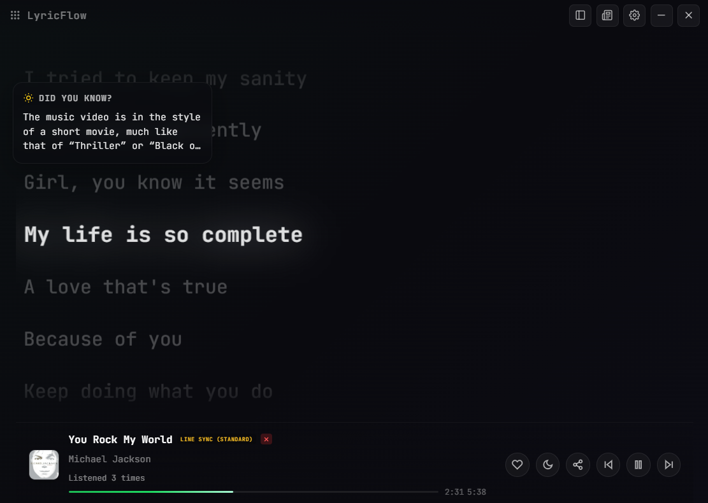
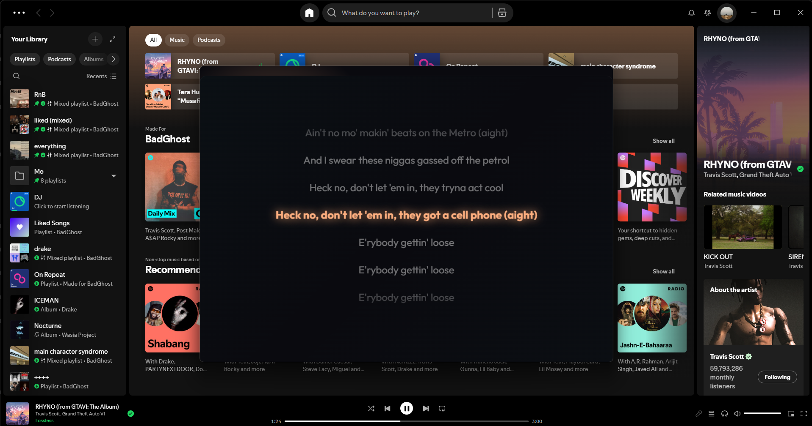
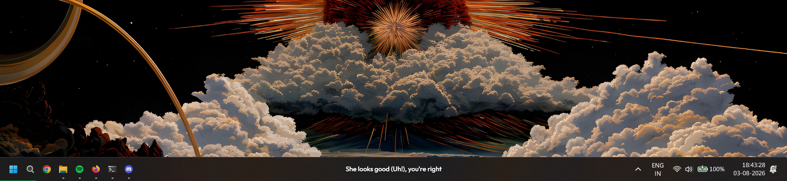
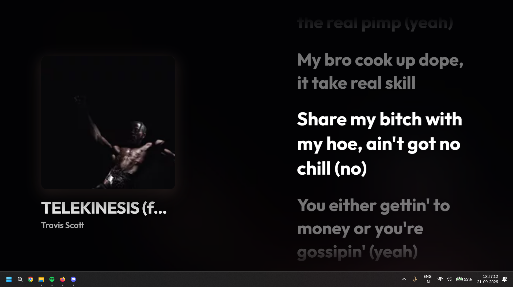
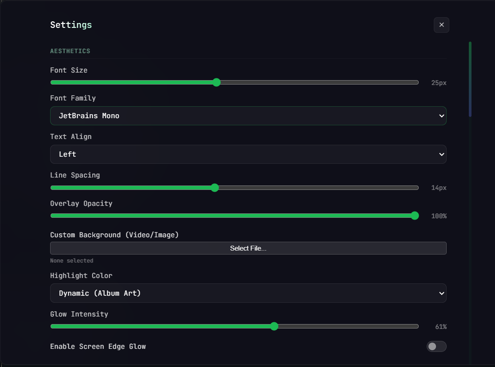

<div align="center">
  
  <h1>LyricFlow</h1>
  <p><strong>A lightweight, glassmorphic desktop lyrics overlay with real-time sync for Spotify and local media.</strong></p>
  <p><i>Rebuilt from the ground up in native Rust & Tauri v2 for ultra-low memory usage (< 30 MB) and instant responsiveness.</i></p>
  
  <p>
    <a href="https://github.com/badghost001/LyricFlow/releases/latest"></a>
    <a href="https://github.com/badghost001/LyricFlow/releases"></a>
    <a href="https://v2.tauri.app/"></a>
    <a href="https://www.rust-lang.org/"></a>
    <a href="LICENSE"></a>
  </p>

  <p>
    <a href="#features">Features</a> •
    <a href="#screenshots">Screenshots</a> •
    <a href="#keyboard-shortcuts">Keyboard Shortcuts</a> •
    <a href="#installation">Installation</a> •
    <a href="#building-from-source">Building from Source</a> •
    <a href="#technologies-used">Technologies Used</a>
  </p>
</div>

---

## ✨ Features

- 🦀 **High-Speed Dual Rust Lyrics Engine:** Queries **LRCLIB** and an optimized **Cloudflare Proxy** in parallel via asynchronous `tokio::join!`. Runs completely in native Rust with zero browser CORS barriers and smart fallback (`LINE_SYNCED` → `PLAIN_TEXT`).
- 🎵 **Real-Time Line Synchronization:** Follows your music line-by-line with smooth clock slew interpolation, track switch debouncing, and per-song sync offset customization.
- 🪟 **Seamless Taskbar & Menu Bar Mode:** Docks lyrics directly into your Windows Taskbar (or macOS Menu Bar). Features sub-millisecond cursor hit-testing, automatic click-through, right-click menu suppression, and continuous `HWND_TOPMOST` z-order keeping.
- 🖼️ **Ambient Wallpaper & Fullscreen Mode:** Transforms your desktop into an immersive music visualizer with Apple Music-inspired blurred album background pan effects, dynamic fluid typography, and Spotify Canvas MP4 loop playback.
- 🎨 **Glassmorphism & Adaptive Palette:** Modern frosted-glass aesthetics with background blur, dynamic color extraction derived on the fly from current album artwork, and optional reactive Screen Edge Glow.
- 📻 **Native OS Media Backends:**
  - **Windows:** Deep integration with Windows SMTC (System Media Transport Controls) via a dedicated MTA COM worker thread—supports Spotify Desktop, YouTube, Apple Music, and local media players.
  - **macOS:** Native AppleScript IPC integration with Spotify Desktop and Apple Music (`Music.app`).
- 🖼️ **High-Resolution Artwork Fallback:** Automatic background enhancement of low-res SMTC thumbnails with crystal-clear 600×600 artwork fetched via native iTunes and Deezer backends.
- 🧠 **Genius & Last.fm Knowledge:** Live song facts, verified annotations, and instant Last.fm scrobbling and playback tracking.
- ⚡ **Ultra-Low Memory Footprint:** Consumes only **~20–30 MB of RAM** (over 90% reduction compared to Electron) with near 0% idle CPU usage.
- 🔄 **Automatic Background Updates:** Seamless background OTA updates verified cryptographically with Minisign.

---

## 📸 Screenshots

### Main Floating Window
*Glassmorphic overlay with dynamic active line glow, live Genius trivia pill, and seamless playback controls.*
<p align="center">
  
</p>

### Synced Floating Overlay
*Positioned effortlessly over Spotify Desktop, keeping your focus on the music.*
<p align="center">
  
</p>

### Taskbar Mode
*Unobtrusive single-line lyrics ticker docked directly into the Windows Taskbar with zero interference to tray or taskbar icons.*
<p align="center">
  
</p>

### Ambient Wallpaper / Fullscreen Mode
*Oversized fluid typography and animated background visuals driven by the current track.*
<p align="center">
  
</p>

### Settings & Aesthetics Panel
*Customize fonts, opacity, highlight glows, custom video/image backgrounds, screen edge glow, and timing offsets.*
<p align="center">
  
</p>

---

## ⌨️ Keyboard Shortcuts

| Shortcut | Action | Description |
|:---|:---|:---|
| <kbd>Ctrl</kbd> + <kbd>Shift</kbd> + <kbd>L</kbd> | **Toggle Click-Through** | Makes overlay transparent to clicks (pass-through for gaming/work) |
| <kbd>Ctrl</kbd> + <kbd>Shift</kbd> + <kbd>C</kbd> | **Copy Active Lyric** | Copies current playing lyric line to clipboard |
| <kbd>Ctrl</kbd> + <kbd>Shift</kbd> + <kbd>S</kbd> | **Share Lyric** | Opens the lyric quote sharing dialog |
| <kbd>Ctrl</kbd> + <kbd>Shift</kbd> + <kbd>Arrows</kbd> | **Nudge Overlay** | Fine-tunes the window position by 2px in any direction |
| <kbd>Ctrl</kbd> + <kbd>[</kbd> / <kbd>]</kbd> | **Adjust Sync Offset** | Shifts lyric timing by -50ms / +50ms |
| <kbd>Ctrl</kbd> + <kbd>0</kbd> | **Reset Sync** | Resets song-specific timing offset to zero |
| <kbd>Ctrl</kbd> + <kbd>R</kbd> | **Alternative Lyrics** | Cycles or picks alternate lyrics candidates |
| <kbd>Ctrl</kbd> + <kbd>Alt</kbd> + <kbd>Space</kbd> | **Play / Pause** | Toggles playback across active media player |
| <kbd>Ctrl</kbd> + <kbd>Alt</kbd> + <kbd>→</kbd> | **Next Track** | Skips to the next song |
| <kbd>Ctrl</kbd> + <kbd>Alt</kbd> + <kbd>←</kbd> | **Previous Track** | Returns to the previous song |

---

## 📦 Installation

### Windows (Recommended)
1. Head over to the latest **[Releases](https://github.com/badghost001/LyricFlow/releases/latest)** page.
2. Download the installer:
   - **NSIS Setup:** `LyricFlow-v1.3.0-Setup.exe` (installs to User/Program Files with desktop shortcut & uninstaller)
   - **MSI Package:** `LyricFlow-v1.3.0-x64.msi`
3. Launch the installer and start enjoying real-time lyrics!

### macOS
1. Go to the **[Releases](https://github.com/badghost001/LyricFlow/releases/latest)** page.
2. Download `LyricFlow.dmg` (Universal binary for Apple Silicon M1–M4 & Intel x86_64).
3. Drag `LyricFlow.app` into your **Applications** folder.
4. *macOS Permission Note:* On first launch, grant automation permissions for Spotify or Apple Music when prompted so LyricFlow can detect playback.

---

## 🛠️ Building from Source

### Prerequisites
- **Node.js 20+** and `npm`
- **Rust 1.80+** (`rustup default stable`)
- **Windows:** C++ build tools (Visual Studio 2022 Build Tools with Desktop C++)

### Build Steps

```bash
# 1. Clone the repository
git clone https://github.com/badghost001/LyricFlow.git
cd LyricFlow

# 2. Install frontend dependencies
npm install

# 3. Run in development mode
npm run tauri:dev

# 4. Build release bundles (NSIS & MSI)
npm run tauri:build
```

Release binaries and installers will be output to `src-tauri/target/release/bundle/`.

---

## 🔬 Technologies Used

- **[Tauri v2](https://v2.tauri.app/)** & **[Rust](https://www.rust-lang.org/)** — Core native runtime, memory management, and asynchronous command layer.
- **Vanilla JS, HTML5 & Modern CSS** — Glassmorphism, hardware-accelerated animations, and responsive layouts without heavy framework bloat.
- **[LRCLIB](https://lrclib.net/)** & **Cloudflare Workers** — High-accuracy, time-synced `.lrc` lyrics streaming.
- **Windows SMTC & Win32 APIs** (`windows` crate) — System Media Transport Controls, native taskbar metrics (`SPI_GETWORKAREA`), and top-level z-order management.
- **AppleScript IPC** — Native media synchronization on macOS.
- **[Genius API](https://genius.com/)** & **[Last.fm API](https://www.last.fm/api)** — Live song annotations and scrobbling.

---

## 🤝 Contributing

Contributions, issues, and feature requests are welcome!
- Feel free to check the [issues page](https://github.com/badghost001/LyricFlow/issues) if you have an idea or bug to report.
- Pull requests for new providers, localized translations, and UI polish are appreciated.

---

## 🎉 Special Thanks

A huge shoutout to the community over at **[BHABHI KI कुटिया](https://discord.gg/bhabhi)** for the feedback, ideas, and early testing!

---

## 📝 License

This project is licensed under a Proprietary License (All Rights Reserved). See the [LICENSE](LICENSE) file for details.

<div align="center">
  <i>Crafted with ❤️ by <a href="https://github.com/badghost001">badghost</a></i>
</div>
