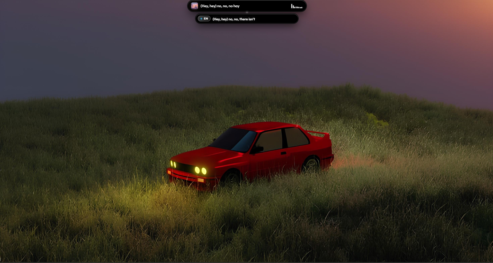
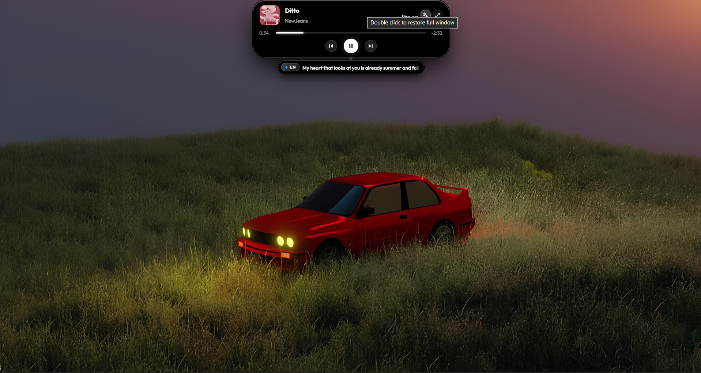
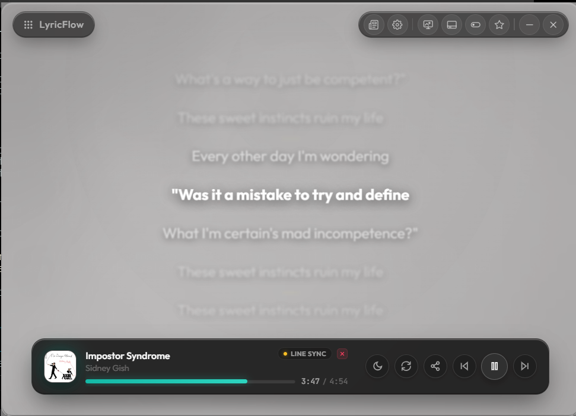
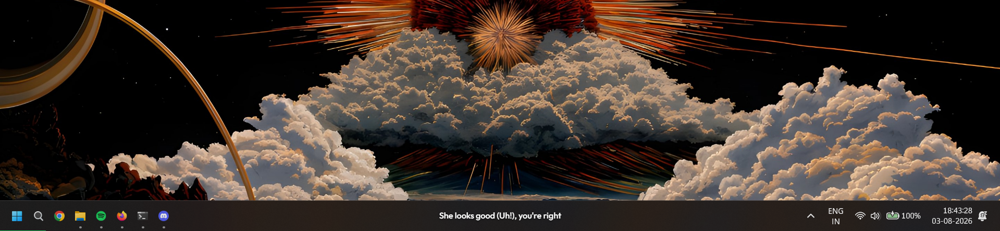
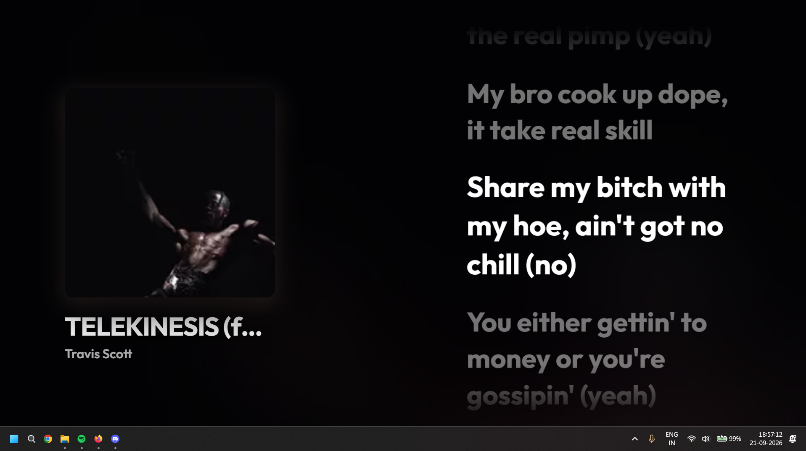
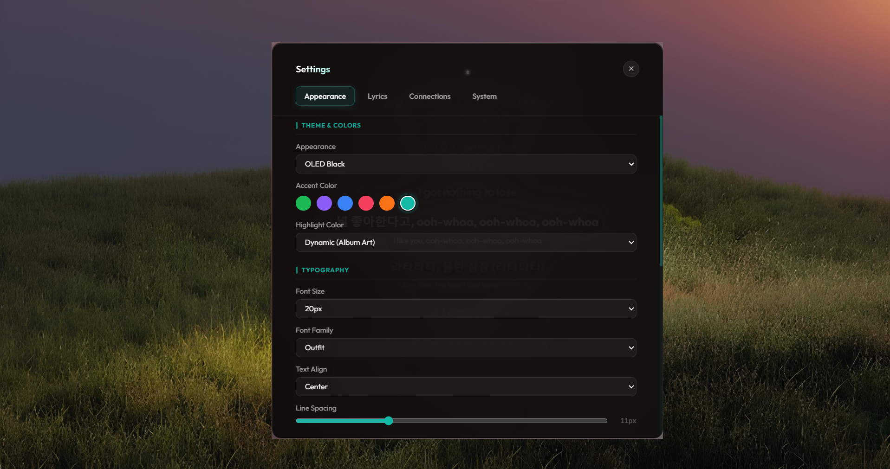
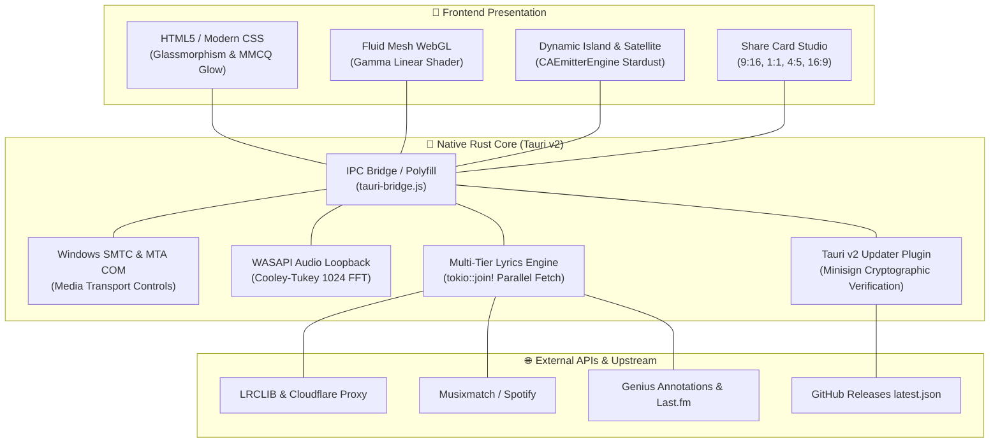

<div align="center">
  
  <h1>LyricFlow</h1>
  <p><strong>A breathtaking, ultra-lightweight desktop lyrics overlay with real-time synchronization, Dynamic Island, and adaptive ambient aesthetics.</strong></p>
  <p><i>Engineered in native Rust (Tauri v2) for sub-30 MB RAM usage, instant responsiveness, and cross-platform performance.</i></p>
  
  <p>
    <a href="https://github.com/badghost001/LyricFlow/releases/latest"></a>
    <a href="https://github.com/badghost001/LyricFlow/releases"></a>
    <a href="https://v2.tauri.app/"></a>
    <a href="https://www.rust-lang.org/"></a>
    <a href="https://github.com/badghost001/LyricFlow/blob/main/LICENSE"></a>
    <a href="https://github.com/badghost001/LyricFlow/blob/main/LICENSE"></a>
  </p>

  <p>
    <a href="#-whats-new-in-v140">What's New</a> •
    <a href="#-key-features">Features</a> •
    <a href="#-screenshots">Screenshots</a> •
    <a href="#-keyboard-shortcuts">Shortcuts</a> •
    <a href="#-installation">Installation</a> •
    <a href="#-building-from-source">Build from Source</a> •
    <a href="#-architecture--tech-stack">Tech Stack</a>
  </p>
</div>

---

## 🌟 What's New in v1.4.0

- 🏝️ **Dynamic Island & Dual-Connected Satellite:** Apple-inspired floating pill with real-time audio visualizer, interactive controls, and an intelligent **Satellite Translation Pill** that docks right below the island for on-the-fly bilingual lyrics.
- ✨ **CoreAnimation Stardust Emitter (`CAEmitterEngine`):** Smooth stardust particle vaporization and materialization animations on inactivity sleep and wake transitions, with silent seamless in-song transitions.
- 🎨 **3D MMCQ Adaptive Color Quantization:** 5-bit color space (`32×32×32` RGB voxel grid) Modified Median Cut Quantization extracting authentic artwork centroids in ~1.6ms. Zero artificial rainbow offsets—preserves genuine monochrome, warm sepia, and obsidian dark covers.
- 🪟 **Luminous White Typography:** High-contrast `#ffffff` lyrics text paired with dynamically extracted artwork glow auras for peak legibility over dynamic album art and video canvases.
- 🔄 **Minisign Cryptographic OTA Auto-Updates:** Full cross-platform background update pipeline with signed `latest.json` manifests for Windows, macOS, and Linux.

---

## ✨ Key Features

### 🏝️ Dynamic Island with Dual Connected Satellite
- **Adaptive Docking Pill:** Floats seamlessly at the top of your screen, displaying current line lyrics, track progress, and album artwork.
- **Dual Connected Satellite Island:** Docks adjacent or below the main island to display real-time line-by-line foreign language translations.
- **Smart Language Detection:** Automatically suppresses redundant translations when lyrics are in English/native languages, smoothly expanding into view only when foreign phrases appear.
- **Inactivity Sleep & Stardust Physics:** Auto-sleeps after customizable idle timeouts (30s, 1m, 2m, 5m, or Never) with particle dispersion animations powered by `CAEmitterEngine`.
- **Integrated Audio Visualizer:** High-performance WASAPI loopback audio reactive frequency bars pulsing directly within the island.

### 🦀 High-Speed Dual-Tier Rust Lyrics Engine
- **Asynchronous Parallel Fetching:** Simultaneously queries **LRCLIB**, high-speed **Cloudflare Proxy**, and **Musixmatch** using `tokio::join!`. Runs in native Rust with zero browser CORS constraints.
- **Smart Waterfall Fallbacks:** Seamless cascade from Word-Synced Karaoke (`WORD_SYNCED`) → Line-Synced (`LINE_SYNCED`) → Plain Text (`PLAIN_TEXT`), backed by Spotify Color-Lyrics, NetEase, and Genius.
- **Syllable-by-Syllable Karaoke Timing:** Word-level glow highlights following the artist's vocal cadence in real time.
- **Clock Slew Interpolation & Debouncing:** Eliminates jitter and desync when seeking, skipping tracks, or resuming playback.

### 🎨 3D MMCQ Ambient Canvas & Glow Engine
- **Modified Median Cut Quantization (MMCQ):** Extracts a synchronized 5-tier color palette (`dominant`, `secondary`, `accent`, `highlight`, `background`) in ~1.6ms with zero synthetic hue offsets.
- **Fluid Mesh WebGL Shader:** Gamma-corrected linear color blending (`pow(c, 2.2)`) with specular sheen crests that match the mood of the album cover.
- **Screen Edge Glow:** Optional peripheral ambient screen border lighting synchronized to the rhythm and color palette of the playing song.
- **Pure White Legibility:** Word and line highlights locked to crisp white typography with dynamic ambient artwork aura.

### 🪟 Flexible Display Modes
- **Floating Glassmorphic Window:** Resizable, draggable frosted-glass window with adjustable background blur, font size, and layout scaling.
- **Windows Taskbar Mode:** Docks single-line synced lyrics directly into the Windows Taskbar (`Shell_TrayWnd`) with sub-millisecond cursor hit-testing and continuous topmost z-order preservation.
- **Ambient Wallpaper & Fullscreen:** Immersive full-screen visualizer mode featuring Apple Music-style blurred artwork pan animations, dynamic typography, and looping Spotify Canvas MP4 playback.

### 📸 Lyric Share Card Studio
- **Multi-Format Social Presets:** Generate visually stunning lyric cards in **Instagram Story (9:16)**, **Square (1:1)**, **Portrait Feed (4:5)**, and **Landscape (16:9)**.
- **Curated Typography Stacks:** Switch between Modern Sans, Editorial Serif, Monospace, and Soft Rounded font stacks.
- **Multi-Mode Lyrics Rendering:** Original lyrics, Bilingual (Original + Translation), or Translation-only view with instant clipboard copying and PNG saving.

### 📻 Deep Native OS Integrations
- **Windows:** System Media Transport Controls (SMTC) via dedicated MTA COM worker thread—supporting Spotify Desktop, Apple Music, YouTube Music, web browsers, and local media players.
- **macOS:** AppleScript IPC for Spotify and Apple Music (`Music.app`).
- **High-Res Artwork Upscaling:** Automatically detects and replaces low-resolution media transport thumbnails with pristine 600×600 artwork from iTunes and Deezer APIs.
- **Genius Facts & Last.fm:** Real-time song annotations, trivia pills, and automatic Last.fm scrobbling.

---

## 📸 Screenshots

<div align="center">

### Dynamic Island with Dual-Connected Satellite Translation
*Floating pill with live WASAPI audio visualizer and docked real-time bilingual translation satellite.*
<br/>


<br/><br/>

### Expanded Dynamic Island & Media Controls
*Interactive track scrubbing, playback controls, and docked translation subtext with zero text cut-off.*
<br/>


<br/><br/>

### 3D MMCQ Adaptive Color Window & White Lyrics
*Pure white typography with luminous artwork glow aura, seamlessly tinted to authentic album palette centroids.*
<br/>


<br/><br/>

### Windows Taskbar Dock Mode
*Unobtrusive single-line lyrics ticker docked directly into the Windows Taskbar with zero interference to icons.*
<br/>


<br/><br/>

### Ambient Wallpaper / Fullscreen Mode
*Fluid typography, animated canvas backgrounds, and Spotify Canvas MP4 loops.*
<br/>


<br/><br/>

### Settings & Aesthetics Studio
*Deep personalization: OLED themes, dynamic album accents, custom fonts, line spacing, and inactivity sleep timers.*
<br/>


</div>

---

## ⌨️ Keyboard Shortcuts

| Shortcut | Action | Description |
| :--- | :--- | :--- |
| <kbd>Ctrl</kbd> + <kbd>Shift</kbd> + <kbd>L</kbd> | **Toggle Click-Through** | Makes overlay transparent to clicks (pass-through for gaming/work) |
| <kbd>Ctrl</kbd> + <kbd>Shift</kbd> + <kbd>C</kbd> | **Copy Active Lyric** | Copies current playing lyric line to clipboard |
| <kbd>Ctrl</kbd> + <kbd>Shift</kbd> + <kbd>S</kbd> | **Share Lyric** | Opens the lyric share card studio dialog |
| <kbd>Ctrl</kbd> + <kbd>Shift</kbd> + <kbd>Arrows</kbd> | **Nudge Overlay** | Fine-tunes the window position by 2px in any direction |
| <kbd>Ctrl</kbd> + <kbd>[</kbd> / <kbd>]</kbd> | **Adjust Sync Offset** | Shifts lyric timing earlier/later by 50ms |
| <kbd>Ctrl</kbd> + <kbd>0</kbd> | **Reset Sync** | Resets song-specific timing offset to zero |
| <kbd>Ctrl</kbd> + <kbd>R</kbd> | **Alternative Lyrics** | Cycles or chooses alternative lyrics candidates |
| <kbd>Ctrl</kbd> + <kbd>Alt</kbd> + <kbd>Space</kbd> | **Play / Pause** | Toggles playback across active media player |
| <kbd>Ctrl</kbd> + <kbd>Alt</kbd> + <kbd>→</kbd> | **Next Track** | Skips to the next song |
| <kbd>Ctrl</kbd> + <kbd>Alt</kbd> + <kbd>←</kbd> | **Previous Track** | Returns to the previous song |

---

## 📦 Installation

Download the latest version from the **[Releases](https://github.com/badghost001/LyricFlow/releases/latest)** page:

### 🪟 Windows
- **NSIS Setup Installer (Recommended):** [`LyricFlow_1.4.0_x64-setup.exe`](https://github.com/badghost001/LyricFlow/releases/download/v1.4.0/LyricFlow_1.4.0_x64-setup.exe)
  - Installs for current user, creates Start Menu and Desktop shortcuts, supports seamless auto-update.
- **Windows MSI Package:** [`LyricFlow_1.4.0_x64_en-US.msi`](https://github.com/badghost001/LyricFlow/releases/download/v1.4.0/LyricFlow_1.4.0_x64_en-US.msi)
  - Standard Windows Installer package suitable for automated or enterprise deployment.

### 🍏 macOS
- **Universal DMG Installer:** [`LyricFlow_1.4.0_universal.dmg`](https://github.com/badghost001/LyricFlow/releases/download/v1.4.0/LyricFlow_1.4.0_universal.dmg)
  - Universal binary running natively on both **Apple Silicon (M1/M2/M3/M4)** and **Intel** Macs.
  - Open the DMG and drag `LyricFlow.app` into your `Applications` folder.
- **Standalone App Bundle:** [`LyricFlow_universal.app.tar.gz`](https://github.com/badghost001/LyricFlow/releases/download/v1.4.0/LyricFlow_universal.app.tar.gz)

### 🐧 Linux
- **Standalone AppImage:** [`LyricFlow_1.4.0_amd64.AppImage`](https://github.com/badghost001/LyricFlow/releases/download/v1.4.0/LyricFlow_1.4.0_amd64.AppImage)
  - Make executable (`chmod +x LyricFlow_1.4.0_amd64.AppImage`) and launch directly on any modern distribution.
- **Debian / Ubuntu Package:** [`LyricFlow_1.4.0_amd64.deb`](https://github.com/badghost001/LyricFlow/releases/download/v1.4.0/LyricFlow_1.4.0_amd64.deb)
  - Install via `sudo dpkg -i LyricFlow_1.4.0_amd64.deb` or Software Center.
- **Fedora / RHEL / openSUSE Package:** [`LyricFlow-1.4.0-1.x86_64.rpm`](https://github.com/badghost001/LyricFlow/releases/download/v1.4.0/LyricFlow-1.4.0-1.x86_64.rpm)
  - Install via `sudo rpm -i LyricFlow-1.4.0-1.x86_64.rpm`.

---

## 🛠️ Building from Source

### Prerequisites
1. **Node.js 20+** and `npm`
2. **Rust stable toolchain** (1.80+):
   ```bash
   rustup default stable
   ```
3. **Platform-specific build dependencies:**
   - **Windows:** Visual Studio 2022 Build Tools (Desktop development with C++).
   - **Linux (Ubuntu/Debian):**
     ```bash
     sudo apt-get update && sudo apt-get install -y libwebkit2gtk-4.1-dev libappindicator3-dev librsvg2-dev patchelf
     ```
   - **macOS:** Xcode Command Line Tools (`xcode-select --install`).

### Build Steps

```bash
# 1. Clone repository
git clone https://github.com/badghost001/LyricFlow.git
cd LyricFlow

# 2. Run unit tests
npm test

# 3. Launch in development mode
npm run tauri:dev

# 4. Compile optimized release bundles
npm run tauri:build
```

Compiled binaries and distribution installers will be generated under `src-tauri/target/release/bundle/`.

---

## 🔬 Architecture & Tech Stack


```mermaid
flowchart TD
    subgraph UI ["🎨 Frontend Presentation"]
        DOM["HTML5 / Modern CSS\n(Glassmorphism & MMCQ Glow)"]
        Mesh["Fluid Mesh WebGL\n(Gamma Linear Shader)"]
        Island["Dynamic Island & Satellite\n(CAEmitterEngine Stardust)"]
        Share["Share Card Studio\n(9:16, 1:1, 4:5, 16:9)"]
    end

    subgraph Rust ["🦀 Native Rust Core (Tauri v2)"]
        Bridge["IPC Bridge / Polyfill\n(tauri-bridge.js)"]
        SMTC["Windows SMTC & MTA COM\n(Media Transport Controls)"]
        WASAPI["WASAPI Audio Loopback\n(Cooley-Tukey 1024 FFT)"]
        Engine["Multi-Tier Lyrics Engine\n(tokio::join! Parallel Fetch)"]
        Updater["Tauri v2 Updater Plugin\n(Minisign Cryptographic Verification)"]
    end

    subgraph Cloud ["🌐 External APIs & Upstream"]
        LRCLIB["LRCLIB & Cloudflare Proxy"]
        Musixmatch["Musixmatch / Spotify"]
        Genius["Genius Annotations & Last.fm"]
        OTA["GitHub Releases latest.json"]
    end

    DOM --- Bridge
    Mesh --- Bridge
    Island --- Bridge
    Share --- Bridge

    Bridge --- SMTC
    Bridge --- WASAPI
    Bridge --- Engine
    Bridge --- Updater

    Engine --- LRCLIB
    Engine --- Musixmatch
    Engine --- Genius
    Updater --- OTA
```

- **Runtime:** [Tauri v2](https://v2.tauri.app/) + [Rust](https://www.rust-lang.org/) (Static binary, memory footprint ~20–30 MB).
- **Color Engine:** 3D Modified Median Cut Quantization (MMCQ) in 5-bit RGB space with specular sheen cresting.
- **Audio DSP:** Real-time 1024-point Cooley-Tukey Radix-2 FFT via Windows WASAPI loopback capture.
- **OTA Verification:** Minisign public-key cryptographic signature verification (`RWTaItANfUTU/0362Wj+EoMDDCWQRsjRp+3xaB3OJ9P7g3gD0Qm2e+MQ`).

---

## 🤝 Contributing

Contributions, bug reports, and suggestions are warmly welcomed!
- Check out the [Issues](https://github.com/badghost001/LyricFlow/issues) page to report bugs or request features.
- Pull requests for additional lyric providers, translations, or UI enhancements are always appreciated.

---

## 🎉 Community & Special Thanks

A huge shoutout to the community over at **[BHABHI KI कुटिया](https://discord.gg/bhabhi)** for continuous testing, feedback, and creative ideas!

---

## 📝 License

This project is licensed under a Proprietary License (All Rights Reserved). See the [LICENSE](LICENSE) file for full details.

<div align="center">
  <i>Crafted with ❤️ by <a href="https://github.com/badghost001">badghost</a></i>
</div>
